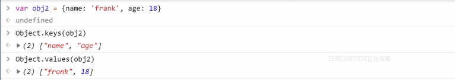

# 《JS 对象基本用法》
## 1.对象的两种语法
**定义**
1. 无序的数据集合
2. 键值对的集合

**它的2种写法**
1. 第一种
```
let obj = { 'name': 'frank', 'age': 18 }
let obj = new Object({'name': 'frank'})
```
这是第一种，2列代码意思一样，只不过第一列是第二列的简写<div>

2. 第二种
```
console.log({ 'name': 'frank, 'age': 18 })
```
**要注意的细节**
* 键名是字符串，不是标识符，可以包含任何字符
* 引号可省略，省略之后就只能写标识符
* <table><tr><td bgcolor=rgb(127, 255, 0)>就算引号省略了，键名也还是字符串</td></tr></table>
## 2.如何删除对象的属性
* delete命令用于删除对象的属性，删除成功后返回true。
* delete obj.xxx或者delete obj['xxx']这两种都可以删除对象属性
* <font color=yellow >注意:</font>obj.xxx===undefined  
不能断定'xxx'是否为obj的属性
## 3.如何查看对象的属性（读）
* 查看对象自身所有属性   

1. 用Object.keys可以查看属性
2. 用Object.values可以查看所以值

## 4.如何修改或增加对象的属性
**直接赋值**  
```
let obj = {name: 'frank'} // name 是字符串
obj.name = 'frank' // name 是字符串
obj['name'] = 'frank' 
obj['na'+'me'] = 'frank'
let key = 'name'; obj[key] = 'frank'
```
我们再来看一下易出错的赋值

```
obj[name] = 'frank' // 错在name是变量<div>
let key = 'name';obj.key = 'frank' // 错在.key是字符串不是变量
```
## 5.'name' in obj和obj.hasOwnProperty('name') 的区别
* 他们两个都是判断属性名是否存在于对象中
* 区别是in会继承原型链上的属性，而obj.hasOwnProperty不会继承原型链中的属性


# that is all ,thank you for your time.


