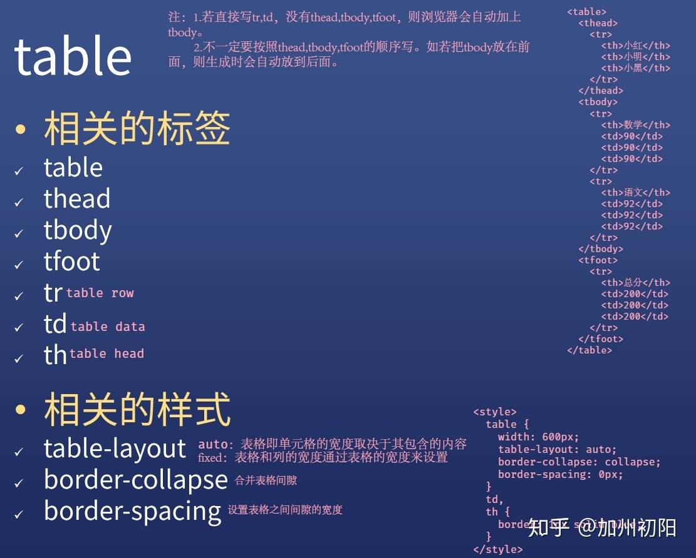

# a 标签
## 属性
* ### href
    hyper reference, 超级链接/引用
* ### target
    `<a href="http://google.com" target="_blank">文本</a>`,在新标签页中打开超链接
* ### download
    下载这个网站，没什么用，不用记
* ### rel=noopener
    学了js以后再来看
## 作用
* 跳转外部页面
* 跳转内部页面
* 跳转到邮箱或者电话等


# a 的 href 的取值
## 网站
* https://google.com
* http://google.com
* //google.com(以后用这个)
  
## 路径
* /a/d/c以及a/b/c
```
/a/b/c为根目录a/b/c为相对目录。
在哪里开的服务，哪里就是根目录。`<a href="/a/b/c.html">c.html</a>`
(双击会打开网页，点这个链接会错，因为这样会认为前缀是file不是http，根目录是本地目录)
```
* index.html以及./index.html
```在当前目录找这个文件```

## 伪代码
* javascript:代码；
```
点击可以直接运行js.
<a href="javascript:alert(1);">javascript伪代码</a>
点击之后什么都不做：<a href="iavascript:;">查看</a>。不可以<a href="">查看</a>(会刷新))或者<a href="#">查看</a>（会跳到顶部）
```
## id
* href=#&&& 跳转到指定标签（就是内部锚点）。<a href="#&&&“>查看&&&</a>
  
# a 的 target 的取值
## 内置名字
* _blank
   在空白页面打开
* _top
   在顶级窗口打开
* _parent
   在当前链接所在的iframe的上一层打开
* _self
   <a href="http://google.com"target"_self">文本</a>。在当前页面打开

# img 标签的用法
## 作用
发出get请求，展示一张图
## 属性
* alt
加载失败时显示的内容
* height
* width
* src
注意高宽不要一块写容易变形
## 事件
可以在图片加载失败的时候进行挽救再加载一张图片
* onlaod 成功时用的
* onerror 失败时用的
  
## 响应式
max-width:100%
让图片适应手机屏幕大小

## 可替换元素
可以面试会考，面试钱突击一下

# table表格命令
* table
* thead
* tbody
* tfoot
* tr:table row
* td:table date
* th:table head



  


