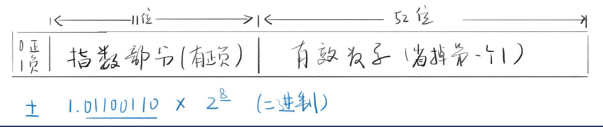

# 数据类型和运算符笔记
## 数字与字符串的区别
功能不同
* 数字是数字，字符串是字符串，要严谨
* 数字能加减乘除，字符串不行
* 字符串能表示电话号码，数字不行
存储形式不同
* JS中，数字的用64位浮点数的形式储存的
* JS中，字符串是用类似UTF8形式储存的

# JS的数据类型
* 数字number
* 字符串string
* 布尔boolean
* 符号symbol
* 空undefined
* 空null
* 对象object

下面是以上各数据类型的详细解释与我的理解

## 数字number
JS里面的数字都采用[64位浮点数](https://zh.wikipedia.org/w/index.php?sort=relevance&search=64%E4%BD%8D%E6%B5%AE%E7%82%B9%E6%95%B0&title=Special:%E6%90%9C%E7%B4%A2&profile=advanced&fulltext=1&advancedSearch-current=%7B%7D&ns0=1)的储存形式
大概解释一下
* 浮点就是浮动的点，意思就是小数点会乱动
* eg：12345.67可以表示为1.234567e10^4
* 也可以表示为1234567e10^-2

64位储存一个number
* 符号占1位
* 指数占11位（-1023~1024）
* 有效数字占52位（开头的1省略）

关于JS number的范围和精度的讨论
**范围（忽略符号位)**
* 指数拉满、有效数字拉满。得到最大的二进制数
* Number.MAX_VALUE:1.7976931348623157E+308
* 指数负方向拉满、有效数字最小1，得到最小值
* Number.MIN_VALUE:5e-324
**精度（有效数字)**
* 最多只能到52+1个二进制位表示有效数字
* 2……53对应的十进制是9后面15个零
* 所以15位有效数字都能精确表示
* 16位有效数字如果小于90开头，也能精确表示
* 9110000000000001就存吧下来

## 字符串string
### 写法
* 单引号<div>
'你好'
* 双引号<div>
"你好"
* 反引号<div>
\`你好`
注意引号不等于字符串的一部分<div>
### 转义<div>
* 错误写法<div>
'it's ok'<div>
JS引擎会认为'it'就结束了
* 正确写法、<div>
'it\'s ok' //这就是转义<div>
"it's ok"<div>
\`it's ok`

### 转义"\\"的用法
* \\'表示'
* \\"表示"
* \\n表示换行
* \\r表示回车
* \\t表示tab制表符
* \\\表示\
* \\uFFFF表示对应的Unicode字符
* \\xFF表示前256个Unicode字符
  
### 一个小知识点

如何在字符串里面换行
let s=\`这样是<div>可以的<div>

用反引号很容易做到\`
### 字符串的长度
```
 string.length
 '123'.length//3
 '\n\r\t'.length//3
 ''.length//0
 ' '.length//1
 ```
 ### 如何读取字符
 string[index]
 * let s='hello'
 * s[0]//"h"
 注意index从0开始
 s[0]是第一个字符

## 布尔 boolean
知识点如下
* 否定运算<div>
!value
* 相等运算<div>
!1==2、1！=2、3===4、3！==4
* 比较运算<div>
1>2、1>=2、3<4、3<=4
### 五个falsy值
falsy就是相当于false但又不是false的值
分别是undefined null 0 NaN ''

## undefined和null两种空类型

——--他们没有本质区别

## 关于object的理解我下期再写，bye~


  
  