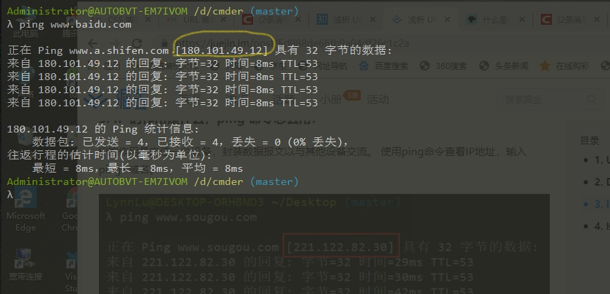

# 浅谈 URL
## 1. URL 包含哪几部分，每部分分别有什么作用?
URL指的是统一资源定位符`（Uniform Resource Locator）`。URL包含协议、域名或IP、端口号、路径、查询参数、锚点。

`http://`是协议，表明了浏览器必须使用何种协议，HTTP或HTTPS。 

`www.example.com`是域名。表明正在请求哪个web服务器。或者，可以直接使用IP address。

`:80 `是端口。表示用于访问Web服务器上的资源的技术“门”。HTTP协议的标准端口，HTTP为80，HTTPS为443。

`/path/to/myfile.html`是网络服务器上资源的路径。在Web的早期阶段，像这样的路径表示Web服务器上的物理文件位置。

`?key1=value1&key2=value2` 是查询参数。 这些参数是用 & 符号分隔的键/值对列表。每个Web服务器都有自己关于参数的规则。

`#SomewhereInTheDocument`是锚点。 锚点表示资源中的一种“书签”，给浏览器显示位于该“加书签”位置的内容的方向。例如，在视频或音频文档上，浏览器将尝试转到锚代表的时间。

## 2. DNS 的作用是什么，nslookup 命令怎么用?
DNS 是域名系统 (Domain Name System) ，它是由解析器和域名服务器组成的。域名服务器是保存有该网络中所有主机的域名和对应IP地址，并将域名转换为IP地址。有了DNS服务器，就不用输入IP地址来访问一个网站，而是可以通过输入网址访问。

使用nslookup来解析域名

## 3. IP 的作用是什么，ping 命令怎么用?
IP的作用是定位一台设备，封装数据报文以与其他设备交流。 使用ping命令查看IP地址，输入ping+域名。

## 4. 域名是什么，分别哪几类域名?
域名（Domain names）是互联网基础架构的关键部分。任何连上互联网的电脑都可以通过一个公共IP地址访问到。
### 域名的分类
* 类别域名(国际域名)共有7个。com(商业公司);.net(网络服务);.org(组织协会等);.gov(政府部门);.edu(教育机构);.mil(军事领域);.int(国际组织)。
* 国别域名(地理顶级域名)，共有243个国家和地区的代码，例如.CN代表中国，.UK代表英国。

