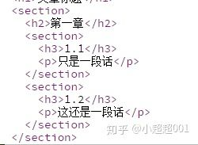
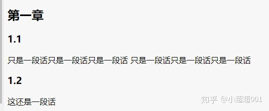
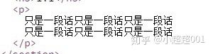
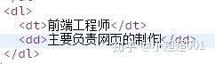
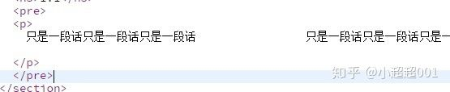
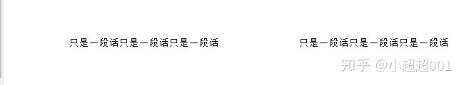
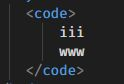
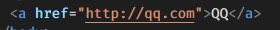

# 《HTML入门笔记1》

  ## HTML简介
  超文本标记语言（英语：HyperText Markup Language，简称：HTML）是一种用于创建网页的标准标记语言。HTML是一种基础技术，常与CSS、JavaScript一起被众多网站用于设计网页、网页应用程序以及移动应用程序的用户界面[3]。网页浏览器可以读取HTML文件，并将其渲染成可视化网页。HTML描述了一个网站的结构语义随着线索的呈现，使之成为一种标记语言而非编程语言。

  ## 1.发明者简介
HTML是由英国科学家蒂姆·伯纳斯-李发明的。
蒂莫西·约翰·伯纳斯-李爵士，OM KBE FRS FREng FRSA FBCS（英语：Sir Timothy John Berners-Lee，1955年6月8日），昵称为蒂姆·伯纳斯-李（英语：Tim Berners-Lee），英国计算机科学家。他是万维网的发明者。1990年12月25日，他成功利用互联网实现了超文本传输协议客户端与服务器的第一次通讯


## 2.HTML起手该如何写
```
<!DOCTYPE html>

<html>

<head>

<title></title>

</head>

<body></body>

</html>
```
## 3.在HTML中我们常常会用到哪些章节标签
* h1-h6
`该标签表示的是从h1开始直到h6的6个大小标题。其中，一个html中应该只有一个h1`

* section
`该标签为章节标签，就像我们写文章一样分为几张几节。那么用标签写出来该是如何呢？如下图`



* p
该标签表示段落，表示文章需要在此进行分段。如下图



* header
该标签表示位于头部的意思

* footer
该标签表示位于底部的意思

* main
该标签表示主要内容。

* aside
和main相反意思是旁支内容，非主体内容

* div该标签主要用来划分区域。

## 4.HTML的全局属性

(1)class 用来增加样式，一个标签内可有多个class

(2)contenteditable 可以使任何一个元素被编辑

(3) hidden 快速让一个东西看不见

(4)id 此id不到万不得已请不要使用

(5) style 主要用来增加样式的

(6) tabindex 控制tab的切换顺序的

(7)title 用来显示……里包含的完整内容

## 5.HTML常见的内容标签
* ol+li有序数据列表
  
* ul+li无序点列表
  
* di+dt+dd描述列表


* pre 如果想保留空格，回车，tab，那么就需要用pre包裹起来。如：



* hr分割线
  
* br换行
  
* code 此标签里面的字体是等宽的 如：


* a  超链接 如:


* em 语气上的强调
  
* strong 本质上的强调
  
* quote 内联引用
  
* blockquote 换行引用
  
# 谢谢观看


